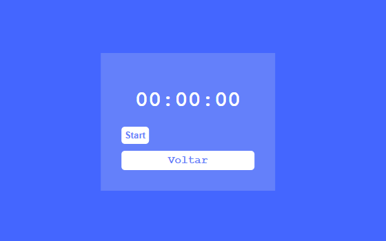

# Cronometro
## Site ao vivo
Link: https://mayron1806.github.io/Cronometro/
## O que é?
É um projeto pequeno com 2 funcionalidades, são elas:
- Timer
- Cronômetro

Ele possue basicamente 3 telas, a primeira delas é a tela de bem vindo


A segunda a tela onde está presenta a funcionalidade de Timer


E por fim a terceira onde está presente a funcionalidade de Cronômetro


## Tecnologias utilizadas
Esse é um projeto bem simples, para sua construção foram usadas basicamente 3 tecnologias:
- HTML
- CSS
- JavaScript

## Para clonar o projeto
Caso  queira clonar o projeto e ver ele funcionando na sua maquina é só rodar o comando abaixo
```
git clone https://github.com/mayron1806/Cronometro
```
